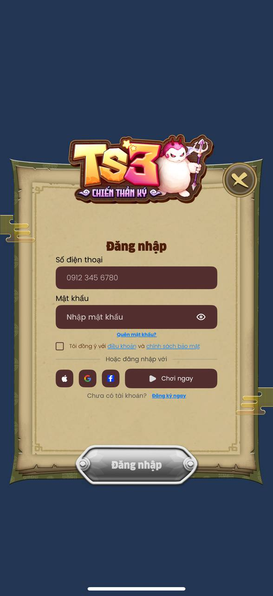

# Unity-iOS SwiftUI AuthSDK Integration Guide



## Table of Contents

1. [Preparation](#preparation)
2. [Add SDK to Xcode Project](#add-sdks-to-xcode-project)
3. [Obj-C Bridge](#obj-c-bridge)
4. [My app controller](#my-app-controller)
5. [Declaration appcontroller as the implemented my app controller](#declaration-appcontroller-as-the-implemented-my-app-controller)
6. [Global shared auth-manager object](#global-shared-auth-manager-object)
7. [Demo dialog view](#demo-dialog-view)

---

## 1. Preparation

1. Go to folder:  
   `UnityExample/iOS`
2. Open the Xcode project:  
   `Unity-iPhone`
3. In Xcode:  
   - Go to **File > Packages > Update to Latest Packages Version**

---

## 2. Add SDKs to Xcode Project

### Add AuthSDK Local Package

1. Open:  
   **Project Settings > Package Dependencies**
2. Click **Add Local**
3. Select folder:  
   `Packages/AuthSDK`
4. Click **Add Package**


### Add PaymentSDK Local Package

1. Open:  
   **Project Settings > Package Dependencies**
2. Click **Add Local**
3. Select folder:  
   `Packages/PaymentSDK`
4. Click **Add Package**

---

## 3. Obj-C Bridge

- Bridge Implementation `AuthManagerObjCBridge.swift`

As generated source from Unity resulting in Obj-C, we need obj-c to bridging to AuthSDK. This Obj-C Bridge has some methods including initSDKWithPackageName, showLoginView, showForceUpdateView, showGameServerViewWithCompletion, showLogoutWithCompletion, showDeactivateAccountWithCompletion, startAutoLinkAccountLoop, stopAutoLinkAccountLoop, refreshTokenWithCompletion, getLatestSessionWithCompletion to talk to the SDK.

To talk to main controller, we need a delegate, AuthResultDelegate, that has also implemented in the file. The delegate consists of some protocols such as didLogout, didAuthenticated, didChangedGameServer, didDeactivateAccount, didRefreshedToken, didGetLatestSession, didLinkAccount, didClose.

In the other hand, some unities, including AuthSessionResponse.asDictionary, KeychainManagerObjCBridge, also has been implemented for transform session object, and saving/loading session data respectively.

- Environment Configuration

Use `setEnvironment()` to configure the SDK environment.

* Staging

```swift
AuthServiceProvider.Builder()
    .setEnvironment(Environment.staging)
    .build()
```

* Production

```swift
AuthServiceProvider.Builder()
    .setEnvironment(Environment.production)
    .build()
```


```swift
@objc public protocol AuthResultDelegate: AnyObject {
    func didLogout(data: Any?)
    func didAuthenticated(data: Any?)
    func didChangedGameServer(data: Any?)
    func didDeactivateAccount(data: Any?)
    func didRefreshedToken(data: Any?)
    func didGetLatestSession(data: Any?)
    func didLinkAccount(data: Any?)
    func didClose()
}
```

```swift
@objc public class AuthManagerObjCBridge: NSObject {

@objc public weak var delegate: AuthResultDelegate?
    
    private let manager: AuthManager
    
    @objc public override init() {
        manager = AuthServiceProvider.Builder().setEnvironment(Environment.staging).build().authManager
    }

    @MainActor @objc public func showLoginView() -> UIViewController { }

    @objc public func initSDKWithPackageName(
        _ packageName: String,
        appVersion: String,
        completion: @escaping (NSDictionary?, NSString?, NSError?) -> Void
    ) { }

    @MainActor @objc public func showForceUpdateView(appStoreId: String, from presentingVC: UIViewController) { }

    @MainActor @objc private func showGameServerView(data: Any) { }

    @MainActor @objc public func showGameServerViewWithCompletion(_ completion: @escaping (NSDictionary?, NSError?) -> Void) -> UIViewController { }

    @objc public func refreshTokenWithCompletion(_ completion: @escaping (NSDictionary?, NSError?) -> Void) { }

    @objc public func getLatestSessionWithCompletion(_ completion: @escaping (NSDictionary?, NSError?) -> Void) { }

    @MainActor @objc public func showLogoutWithCompletion(_ completion: @escaping (NSDictionary?, NSError?) -> Void) -> UIViewController { }

    @MainActor @objc public func showDeactivateAccountWithCompletion(_ completion: @escaping (NSDictionary?, NSError?) -> Void) -> UIViewController { }

    @objc public func startAutoLinkAccountLoop(timeToRemindInSeconds: Int = 60, guestToken: String, _ completion: @escaping (NSDictionary?, NSError?) -> Void) { }

    @objc public func stopAutoLinkAccountLoop() {
        autoLinkTimer?.invalidate()
        autoLinkTimer = nil
    }
}
```

```swift
extension AuthSessionResponse {
    func asDictionary() -> NSDictionary {
        var dict = [String: Any]()
        dict["accessToken"] = self.accessToken
        dict["gameUID"] = self.gameUUID
        dict["serverId"] = self.serverId
        dict["refreshToken"] = self.refreshToken
        dict["isNewUser"] = self.isNewUser
        dict["isGuestUser"] = self.loginReminderResponse?.isGuestUser ?? false
        dict["loginAfterSeconds"] = self.loginReminderResponse?.loginAfterSeconds ?? 0
        return dict as NSDictionary
    }
}
```
---

## 4. My app controller
To make source code clearer, we ought to implement an extended class from UnityAppController, naming MyAppController. That Obj-C class has to have the delegate and startSDK method.

This is an interface
```Objective-C
// MyAppController.h
#import <UnityFramework/UnityFramework.h>
#import <UnityFramework/UnityAppController.h>
#import <MenuDialogViewController.h>

@interface MyAppController : UnityAppController
@end

@interface MyAppController () <AuthResultDelegate>
@end

extern "C" {
    void startSDK(id<AuthResultDelegate> delegate);
}
```

This is an implementation of the delegate
```Objective-C
@implementation MyAppController

- (void)didLogoutWithData:(id)data {
    NSLog(@"Did Logout");
    // TODO: Add your business here
    [[KeychainManagerObjCBridge shared] clearAuthSession];
    
}

- (void)didClose {
    NSLog(@"Did Login Close");
    // TODO: Add your business here
}

- (void)didRefreshedTokenWithData:(id)data {
    // TODO: Add your business here
    NSLog(@"Refreshed Token Success");
}

- (void)didAuthenticatedWithData:(id)data {
    // TODO: Add your business here
    NSLog(@"Did Login or register Success/Failure");
}

- (void)didChangedGameServerWithData:(id _Nullable)data { 
    NSLog(@"Did Change Game Server");
    // TODO: Add your business here
}

- (void)didDeactivateAccountWithData:(id _Nullable)data { 
    NSLog(@"Did Deactivate Account");
    // TODO: Add your business here
    [[KeychainManagerObjCBridge shared] clearAuthSession];
}

- (void)didGetLatestSessionWithData:(id _Nullable)data { 
    NSLog(@"Did Get Latest Session");
    // TODO: Add your business here
}

- (void)didLinkAccountWithData:(id _Nullable)data { 
    NSLog(@"Did Link Account");
    // TODO: Add your business here
}

```

In the implementation, we need to initilize Facebook configuration
```Objective-C
- (BOOL)application:(UIApplication*)application didFinishLaunchingWithOptions:(NSDictionary*)launchOptions
{
    [FontLoaderObjCBridge loadAllFonts];
    
    // Facebook SDK init
    [[FBSDKApplicationDelegate sharedInstance] application:application didFinishLaunchingWithOptions:launchOptions];
    
    // Set Facebook settings
    [FBSDKSettings.sharedSettings setAppID:@"1161544315137705"];
    [FBSDKSettings.sharedSettings setClientToken:@"6a2631357b252d0ba6818832146a59dc"];
    FBSDKSettings.sharedSettings.autoLogAppEventsEnabled = NO;
    [FBSDKSettings.sharedSettings enableLoggingBehavior:FBSDKLoggingBehaviorDeveloperErrors];
    
    // Call super for Unity init
    return [super application:application didFinishLaunchingWithOptions:launchOptions];
}

// iOS 10+ method
- (BOOL)application:(UIApplication *)app openURL:(NSURL *)url options:(NSDictionary<UIApplicationOpenURLOptionsKey,id> *)options
{
    // Handle Facebook SDK
    BOOL handledByFacebook = [[FBSDKApplicationDelegate sharedInstance] application:app openURL:url options:options];
    // Handle Unity by calling super (parent logic)
    BOOL handledByUnity = [super application:app openURL:url options:options];
    
    // Return YES if either handler handled the URL
    return handledByFacebook || handledByUnity;
}

// iOS 9 method
- (BOOL)application:(UIApplication *)application
            openURL:(NSURL *)url
  sourceApplication:(NSString *)sourceApplication
         annotation:(id)annotation
{
    // Handle Facebook SDK
    BOOL handledByFacebook = [[FBSDKApplicationDelegate sharedInstance] application:application
                                                                            openURL:url
                                                                  sourceApplication:sourceApplication
                                                                         annotation:annotation];
    // Handle Unity by calling super (parent logic)
    BOOL handledByUnity = [super application:application openURL:url sourceApplication:sourceApplication annotation:annotation];
    
    // Return YES if either handler handled the URL
    return handledByFacebook || handledByUnity;
}
```

We also need to implement startSDK body method
```Objective-C
void startSDK(id<AuthResultDelegate> delegate) { 
    // add the business here    
}
```

The most essential thing is that we need to start SDK when app become active
```Objective-C
- (void)applicationDidBecomeActive:(UIApplication*)application
{
    // Call Unity's logic first
    [super applicationDidBecomeActive:application];
    
    // Your custom logic here (runs after Unity is ready)
    dispatch_async(dispatch_get_main_queue(), ^{
        startSDK(self); // <-- Your extra behavior
    });
}
```


## 5. Declaration appcontroller as the implemented my app controller
In Classes/main.m
```Objective-C
const char* AppControllerClassName = "MyAppController";
```

**Call showSDKView(self) in applicationDidBecomeActive**:

```Objective-C
dispatch_async(dispatch_get_main_queue(), ^{
    showSDKView(self);
});
```

## 6. Global shared auth-manager object
To apply auth-manager as a global object, we need to declare it as below implementation

The declaration
```Objective-C
#ifndef AuthManagerBridgeGlobal_h
#define AuthManagerBridgeGlobal_h

// AuthManagerBridgeGlobal.h
#import <Foundation/Foundation.h>

@class AuthManagerObjCBridge;

extern AuthManagerObjCBridge *GlobalAuthManagerBridge(void);

#endif /* AuthManagerBridgeGlobal_h */
```

The implementation
```Objective-C
#import "AuthManagerBridgeGlobal.h"
#import <UnityFramework/UnityFramework-Swift.h>

AuthManagerObjCBridge *GlobalAuthManagerBridge(void) {
    static AuthManagerObjCBridge *bridge = nil;
    static dispatch_once_t onceToken;
    dispatch_once(&onceToken, ^{
        bridge = [[AuthManagerObjCBridge alloc] init];
    });
    return bridge;
}
```

## 7. Demo dialog view
To illustrate all of SDK feature, we have MenuDialogViewController to show and help you to test all of features.
